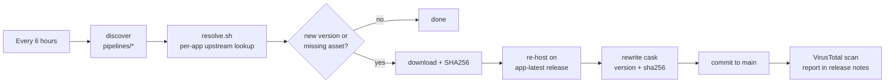

<div align="center">

# engels74/taps

**One Homebrew tap for macOS apps that homebrew-cask does not carry, kept current automatically.**

[](https://github.com/engels74/homebrew-taps/actions/workflows/update-casks.yml)
[](https://github.com/engels74/homebrew-taps/actions/workflows/lint.yml)
[](LICENSE)
[](#-support-the-developers)

```bash
brew install --cask engels74/taps/<app>
```

</div>

Every cask here re-hosts an upstream build on this repository's releases, checks it with VirusTotal, and is refreshed every six hours by a shared pipeline. Apps that Gatekeeper would block are de-quarantined on install, so they open like anything else.

## 💛 Support the developers

This tap only re-packages other people's work. If an app earns a place in your Dock, send something to the person who builds it. Each cask prints this reminder on install and on every upgrade.

| App | Support upstream |
| --- | --- |
| **Flixor** | [](https://ko-fi.com/flixor) |
| **Fred TV** | [](https://github.com/sponsors/Fredolx) [](https://paypal.me/fredolx) [](https://github.com/Fredolx/open-tv#donate-crypto-thank-you) |
| **Paicord** | [](https://github.com/sponsors/llsc12) |
| **FCast Sender** | No donation page. [Star the project](https://github.com/futo-org/fcast), file bugs, contribute. |
| **qView** | No donation page. [Star the project](https://github.com/jurplel/qView), file bugs, contribute. |

**Support this tap.** The pipeline, hosting, and upkeep are done by [@engels74](https://github.com/engels74). Monero is welcome:

[](#-support-the-developers)

```text
8Awh9TSyJPZT99RWbVpd6sDLKNCLAWKm5M6chez7T1emhJDJXdoX583bzVRHjpn2Ej7jFqn3fEzkBMYYBFax5vqj97MvC72
```

## Apps

| App | What it is | Install | Requires |
| --- | --- | --- | --- |
| [FCast Sender](https://fcast.org/) | Cast video and audio from your Mac to any FCast receiver | `brew install --cask engels74/taps/fcast-sender` | Apple Silicon, macOS 11+ |
| [Flixor](https://github.com/Flixorui/flixor) | Plex client with a Netflix-like UI, built in SwiftUI | `brew install --cask engels74/taps/flixor` | macOS 13+ |
| [Fred TV](https://github.com/Fredolx/open-tv) | Ultra-fast IPTV app, formerly Open TV | `brew install --cask engels74/taps/fredtv` | macOS, `mpv` (installed for you) |
| [Paicord](https://github.com/llsc12/Paicord) | Native Discord client written in Swift | `brew install --cask engels74/taps/paicord` | macOS 14+ |
| [qView](https://github.com/jurplel/qView) | Practical and minimal image viewer | `brew install --cask engels74/taps/qview` | macOS 12+ |

Casks live in `Casks/<category>/`: `media/` holds FCast Sender, Flixor, Fred TV and qView; `social/` holds Paicord. The category is only a folder; the install command never changes.

### App notes

- **FCast Sender** ships only an `aarch64` build, so Intel Macs are not supported. The app is signed and notarized by FUTO, so no quarantine workaround is applied. Versions drop the pre-release suffix the upstream tag carries: `sender-0.0.3-beta` becomes `0.0.3`.
- **Flixor** versions match upstream tags such as `beta2.4.0`. The app bundle is `FlixorMac.app`.
- **Fred TV** depends on the `mpv` formula, which Homebrew installs alongside it. Versions strip a leading `v` (`v1.9.1` becomes `1.9.1`).
- **Paicord** has no upstream releases. Each cask version is `YYYY-MM-DD-<short sha>` of the newest successful upstream build.

  > [!WARNING]
  > Paicord is an unofficial, third-party Discord client. Using it violates Discord's Terms of Service and your account may be suspended or banned. **Use at your own risk.**

- **qView** is disabled in the official homebrew-cask repository because of a Gatekeeper check. This cask removes the `com.apple.quarantine` attribute after install, so the app launches without a manual `xattr`.

Flixor, Fred TV, Paicord and qView are distributed unsigned upstream; each of those casks runs a `postflight_steps` block that strips the quarantine attribute from the installed app.

## Install, update, uninstall

```bash
# Install (taps the repository automatically)
brew install --cask engels74/taps/<app>

# Or tap first, then install by short name
brew tap engels74/taps
brew install --cask <app>

# Update
brew upgrade --cask <app>

# Uninstall
brew uninstall --cask <app>

# Uninstall and remove application data
brew uninstall --cask --zap <app>

# Remove the tap
brew untap engels74/taps
```

## Migrating from the old single-app taps

`engels74/fcast-sender`, `engels74/flixor`, `engels74/fredtv`, `engels74/paicord` and `engels74/qview` are retired and no longer receive updates. Homebrew will not install a cask from this tap while the same-named cask from an old tap is installed, so migrate with:

```bash
brew uninstall --cask <app>            # keeps your settings and data; do not --zap
brew untap engels74/<app>
brew install --cask engels74/taps/<app>
```

## How it works



- [`update-casks.yml`](.github/workflows/update-casks.yml) runs on a six-hour schedule, lists every `pipelines/<app>/` directory, and runs the shared [`_update-cask.yml`](.github/workflows/_update-cask.yml) once per app, one at a time.
- `pipelines/<app>/resolve.sh` is the only app-specific code: it finds the newest upstream build and validates the tag and asset name strictly before anything else runs.
- The DMG is downloaded, hashed, and attached to this repository's rolling `<app>-latest` release, and the cask's `version` and `sha256` lines are rewritten and committed. Every release page carries the upstream reference, the checksum source, and a VirusTotal report.
- [`lint.yml`](.github/workflows/lint.yml) runs `brew style`, `brew audit`, and shellcheck on every change.

Releases: <https://github.com/engels74/homebrew-taps/releases>

## Adding a cask

Three files, no workflow changes:

1. `Casks/<category>/<app>.rb` with `url` pointing at `releases/download/<app>-latest/<Prefix>-#{version}.dmg` and a donation `caveats` block.
2. `pipelines/<app>/config.env` with the display name, upstream repo, asset prefix and donation links.
3. `pipelines/<app>/resolve.sh` that writes `version` and `download_url` (see the existing resolvers and the contract at the top of `scripts/resolve.sh`).

`bash scripts/discover.sh` should then list the new app, and `GH_TOKEN=$(gh auth token) bash scripts/resolve.sh <app>` should print its current version. Details in [AGENTS.md](AGENTS.md).

## License and attribution

This is an unofficial, community-maintained tap, not affiliated with any of the upstream developers. The tap itself is licensed under [AGPL-3.0](LICENSE). The apps keep their own licenses:

| App | Upstream license |
| --- | --- |
| FCast Sender | [MIT](https://github.com/futo-org/fcast/blob/master/LICENSE) |
| Flixor | [Flixor Public License](https://github.com/Flixorui/flixor/blob/main/LICENSE.md) |
| Fred TV | [GPL-2.0](https://github.com/Fredolx/open-tv/blob/main/LICENSE) |
| Paicord | [GPL-3.0](https://github.com/llsc12/Paicord/blob/main/LICENSE) |
| qView | [GPL-3.0](https://github.com/jurplel/qView/blob/main/LICENSE) |

`scripts/vendor/gh-workflow-immortality.sh` is [gh-workflow-immortality](https://github.com/PhrozenByte/gh-workflow-immortality) by Daniel Rudolf, vendored unchanged under the MIT license.
