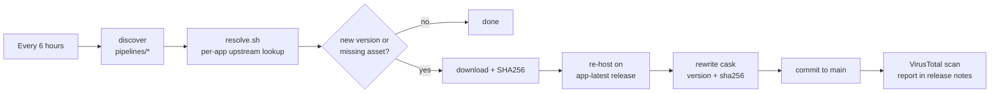

<div align="center">

# engels74/taps

**macOS casks and Linux source formulae, kept current automatically.**

[](https://github.com/engels74/homebrew-taps/actions/workflows/update-casks.yml)
[](https://github.com/engels74/homebrew-taps/actions/workflows/lint.yml)
[](LICENSE)
[](#-support-the-developers)

</div>

macOS casks re-host upstream builds. Linux formulae build the native desktop apps and publish eligible bottles only after both architectures pass CI. Both pipelines check for updates every six hours. VirusTotal scanning is optional when `VT_API_KEY` is configured. Apps that Gatekeeper would block are de-quarantined on install, so they open like anything else.

## 💛 Support the developers

This tap only re-packages other people's work. If an app earns a place in your Dock, send something to the person who builds it. Each cask prints this reminder on install and on every upgrade.

| App | Support upstream |
| --- | --- |
| **Flixor** | [](https://ko-fi.com/flixor) |
| **Fred TV** | [](https://github.com/sponsors/Fredolx) [](https://paypal.me/fredolx) [](https://github.com/Fredolx/open-tv#donate-crypto-thank-you) |
| **Paicord** | [](https://github.com/sponsors/llsc12) |
| **FCast Sender** | No donation page. [Star the project](https://github.com/futo-org/fcast), file bugs, contribute. |
| **qView** | No donation page. [Star the project](https://github.com/jurplel/qView), file bugs, contribute. |

**Support this tap.** The pipeline, hosting, and upkeep are done by [@engels74](https://github.com/engels74). Monero is welcome:

[](#-support-the-developers)

```text
8Awh9TSyJPZT99RWbVpd6sDLKNCLAWKm5M6chez7T1emhJDJXdoX583bzVRHjpn2Ej7jFqn3fEzkBMYYBFax5vqj97MvC72
```

## Apps

| App | macOS cask | Linux formula | Decision |
| --- | --- | --- | --- |
| [FCast Sender](https://fcast.org/) | ARM64, macOS 11+ | ARM64 / x86_64 | Native Rust/Slint desktop Sender; Intel Mac remains restricted pending a validated build |
| [Flixor](https://github.com/Flixorui/flixor) | Universal, macOS 13+ | Unavailable | The packaged `FlixorMac.app` is SwiftUI/AppKit; the web app is a different product variant |
| [Fred TV](https://github.com/Fredolx/open-tv) | Universal | ARM64 / x86_64, source-only | Native Tauri app; installs `mpv`, `ffmpeg` and `yt-dlp` |
| [Paicord](https://github.com/llsc12/Paicord) | Universal, macOS 14+ | Unavailable | SwiftUI macOS client; upstream Linux work is incomplete |
| [qView](https://github.com/jurplel/qView) | Universal, macOS 12+ | ARM64 / x86_64 | Native Qt 6 app with X11, Wayland and image-format plugins |

Use `brew install --cask engels74/taps/<app>` on macOS and `brew install --formula engels74/taps/<app>` on Linux. Tokens are `fcast-sender`, `flixor`, `fredtv`, `paicord`, and `qview`. Always specify the package kind where both exist.

Architecture availability is distinct from runtime coverage. See [compatibility evidence and validation](docs/platform-support.md) for tested versions, limitations and the remaining desktop checks. Intel macOS is now a [Homebrew Tier 3 platform](https://docs.brew.sh/Support-Tiers); existing universal casks remain available on a best-effort basis. The app minimum OS is not a promise of Homebrew support on that OS.

Casks live in `Casks/<category>/`: `media/` holds FCast Sender, Flixor, Fred TV and qView; `social/` holds Paicord. The category is only a folder; the install command never changes.

### App notes

- **FCast Sender** upstream macOS DMGs contain only an `aarch64` main executable, so Intel Macs remain unsupported by the cask. The app is signed and notarized by FUTO, so no quarantine workaround is applied. Versions drop the pre-release suffix the upstream tag carries: `sender-0.0.3-beta` becomes `0.0.3`.
- **Flixor** versions match upstream tags such as `beta2.4.0`. The app bundle is `FlixorMac.app`.
- **Fred TV** depends on `mpv`, `ffmpeg` and `yt-dlp`, which Homebrew installs alongside it. Versions strip a leading `v` (`v1.9.1` becomes `1.9.1`).
- **Paicord** uses immutable upstream `paicord-nightly-<run-id>` releases. The resolver verifies the release tag against the successful main-branch build commit and selects its exact DMG. Each cask version remains `YYYY-MM-DD-<short sha>`.

  > [!WARNING]
  > Paicord is an unofficial, third-party Discord client. Using it violates Discord's Terms of Service and your account may be suspended or banned. **Use at your own risk.**

- **qView** is disabled in the official homebrew-cask repository because of a Gatekeeper check. This cask removes the `com.apple.quarantine` attribute after install, so the app launches without a manual `xattr`.

Flixor, Fred TV, Paicord and qView are distributed unsigned upstream; each of those casks runs a `postflight_steps` block that strips the quarantine attribute from the installed app.

## Install, update, uninstall

Use the cask token from the [Apps](#apps) table (e.g. `fcast-sender`) for `<app>` below.

```bash
# Install (taps the repository automatically)
brew install --cask engels74/taps/<app>

# Or tap first, then install by short name
brew tap engels74/taps
brew install --cask <app>

# Update
brew upgrade --cask <app>

# Uninstall
brew uninstall --cask <app>

# Uninstall and remove application data
brew uninstall --cask --zap <app>

# Remove the tap
brew untap engels74/taps
```

### Linux desktop setup

Use Homebrew's default Linux prefix, `/home/linuxbrew/.linuxbrew`, on a supported ARM64 or x86_64 host. Published bottles target Ubuntu 24.04 or newer (glibc 2.39+). Fred TV always builds from source pending license clarification. For the other formulae, Homebrew builds from source before the first successful bottle publication; Rust builds can take tens of minutes and require several GB of free disk space.

```bash
brew install --formula engels74/taps/qview
qview picture.png
brew upgrade --formula engels74/taps/qview
brew uninstall --formula engels74/taps/qview
```

The other launch commands are `fredtv` and `fcast-sender`. Desktop entries use absolute Homebrew paths. Add the following to your desktop session's environment and log in again to expose the launchers and icons:

```bash
export XDG_DATA_DIRS="/home/linuxbrew/.linuxbrew/share:${XDG_DATA_DIRS:-/usr/local/share:/usr/share}"
```

Your desktop must provide X11 or Wayland, a session D-Bus, and audio. FCast screen sharing also needs the desktop's PipeWire service and a compatible `xdg-desktop-portal` ScreenCast backend. Install those services through your distribution/desktop. The tap installs only a GStreamer PipeWire plugin alongside Homebrew's libraries; it does not start another audio server or portal. Fred TV's wrapper exposes its external media tools to launches from desktop menus.

Formula uninstall removes the launcher, desktop entry, icons and binaries, and preserves settings, sources and recordings. Formulae have no cask `--zap` equivalent. `brew autoremove` can remove unused dependencies; review its output before confirming. Do not run GUI apps with `sudo`.

## Migrating from the old single-app taps

`engels74/fcast-sender`, `engels74/flixor`, `engels74/fredtv`, `engels74/paicord` and `engels74/qview` are retired and no longer receive updates. Homebrew will not install a cask from this tap while the same-named cask from an old tap is installed, so migrate with:

```bash
brew uninstall --cask <app>            # keeps your settings and data; do not --zap
brew untap engels74/<app>
brew install --cask engels74/taps/<app>
```

## How it works



- [`update-casks.yml`](.github/workflows/update-casks.yml) runs on a six-hour schedule, discovers cask-enabled `pipelines/<app>/` directories, and runs the shared [`_update-cask.yml`](.github/workflows/_update-cask.yml) once per app, one at a time.
- `pipelines/<app>/resolve.sh` is the only app-specific code: it finds the newest upstream build and validates the tag and asset name strictly before anything else runs.
- The DMG is downloaded, hashed, and attached to this repository's rolling `<app>-latest` release, and the cask's `version` and `sha256` lines are rewritten and committed. Release notes carry the upstream reference and checksum provenance; configured VirusTotal scans append report links. Before publishing, macOS checks verify the bundle identifier and all Mach-O architectures. Existing versioned assets are retained; published bytes must match the downloaded upstream bytes.
- [`formulae.yml`](.github/workflows/formulae.yml) independently pins source releases to immutable commits, builds all four formulae on native Linux ARM64 and x86_64 runners, checks linkage, tests X11/Wayland launches, and reinstalls eligible local bottles before publication. `pipelines/bottles.json` explicitly allows binary publication for qView, FCast Sender and the PipeWire plugin; Fred TV stays source-only while its GPL-2.0/OpenSSL 3 linking terms are clarified. Failed builds leave published formulae unchanged. Source changes under an existing version require explicit review.
- Linux releases use immutable `formulae-<run-id>-<attempt>` tags with bottles, bottle metadata, checksums, corresponding source archives and build recipes. Sources include locked Rust dependencies and Fred TV's npm packages, with their license files. Homebrew dependencies are installed separately. No automatic release pruning is performed.
- Cask and formula publication share a concurrency lock. Candidate source edits are committed only after the complete release has been uploaded and downloaded again to verify its checksums. Source/binary version fields and bottle blocks are machine-owned after bootstrap.
- [`lint.yml`](.github/workflows/lint.yml) runs Homebrew parse/style/audit checks, macOS bundle inspection, shellcheck, actionlint and pipeline regression tests.

Releases: <https://github.com/engels74/homebrew-taps/releases>

## Adding a cask

Four components, no workflow changes:

1. `Casks/<category>/<app>.rb` with `url` pointing at `releases/download/<app>-latest/<Prefix>-#{version}.dmg` and a donation `caveats` block.
2. `pipelines/<app>/config.env` with the display name, upstream repo, asset prefix and donation links.
3. `pipelines/<app>/resolve.sh` that writes `version` and `download_url` (see the existing resolvers and the contract at the top of `scripts/resolve.sh`).
4. An entry in `scripts/inspect-macos.py` with the verified app bundle, bundle identifier and supported architectures.

`bash scripts/discover.sh` should then list the new app, and `GH_TOKEN=$(gh auth token) bash scripts/resolve.sh <app>` should print its current version. Details in [AGENTS.md](AGENTS.md).

## License and attribution

This is an unofficial, community-maintained tap, not affiliated with any of the upstream developers. The tap itself is licensed under [AGPL-3.0](LICENSE). The apps keep their own licenses:

| App | Upstream license |
| --- | --- |
| FCast Sender | [MIT source](https://github.com/futo-org/fcast/blob/master/LICENSE), plus [GPL-3.0 Linux distribution](https://github.com/futo-org/fcast/blob/master/senders/extra/LICENSE-GPL) using Slint's GPL option |
| Flixor | [Flixor Public License](https://github.com/Flixorui/flixor/blob/main/LICENSE.md): custom AGPL-based license with noncommercial and public-source restrictions; commercial use requires upstream permission |
| Fred TV | [GPL-2.0](https://github.com/Fredolx/open-tv/blob/main/LICENSE) |
| Paicord | [GPL-3.0](https://github.com/llsc12/Paicord/blob/main/LICENSE) |
| qView | [GPL-3.0](https://github.com/jurplel/qView/blob/main/LICENSE) |
| PipeWire GStreamer plugin | [MIT](https://gitlab.freedesktop.org/pipewire/pipewire/-/blob/master/COPYING) |

`scripts/vendor/gh-workflow-immortality.sh` is [gh-workflow-immortality](https://github.com/PhrozenByte/gh-workflow-immortality) by Daniel Rudolf, vendored unchanged under the MIT license.
